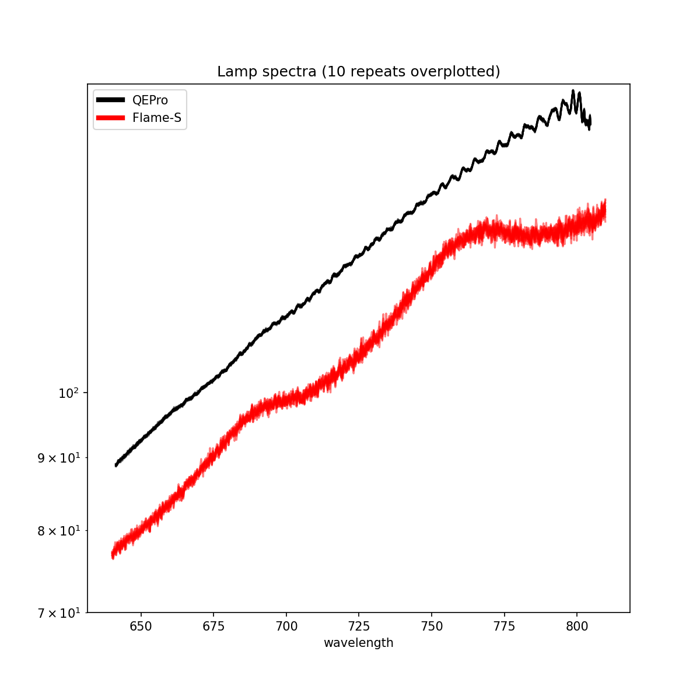

# Piccolo-Lite
> NOTE: this project is under development and not considered stable

Stripped down xarray implementation to read/calibrate/convert piccolo spectral sequences into NetCDF4 files.

The design principals are:
- Allow simple access to the Piccolo datasets
- Use the xarray/NetCDF4 data models
- Make use of coordinates and attributes in order to keep the metadata with the measurement
- Apply radiometric correction in one transformation
- Append metadata after any processing to describe the transformation

> This is not affiliated with the original Piccolo project. Their homepage can be found [here](https://github.com/TeamPiccolo/).

## Installation
```bash
git clone git@github.com:joe-fennell/piccolo-lite.git
cd piccolo-lite
pip install .
```

## Getting Started
```python
import piccololite

# this will need to be updated if run outside the repository root
root = 'test/unit/data/'
cals = ['S_FLMS01691_CalCoeffs.csv', 'S_QEP00984_CalCoeffs.csv']
cal_paths = [os.path.join(root, x) for x in cals]

pic_seq = read_piccolo_sequence(root)
rc = RadiometricCorrection(cal_paths)
corrected = rc.transform(pic_seq)

# Plotting
custom_lines = [Line2D([0], [0], color='k', lw=4),
                Line2D([0], [0], color='r', lw=4)]

f, ax = plt.subplots(figsize=(8,8))
for CAPTURE in corrected:
    corrected[CAPTURE]['S_FLMS01691']['Downwelling'].sel(wavelength=slice(640,810)).plot(c='r', ax=ax, alpha=.5)

for CAPTURE in corrected:
    corrected[CAPTURE]['S_QEP00984']['Downwelling'].plot(c='k', ax=ax, alpha=.5)

ax.set_ylim(70,165)
ax.legend(custom_lines, ['QEPro','Flame-S'])
ax.set_title('Lamp spectra (10 repeats overplotted)')

```

## Documentation
API reference can be found [here](docs/API.md)

## Development
